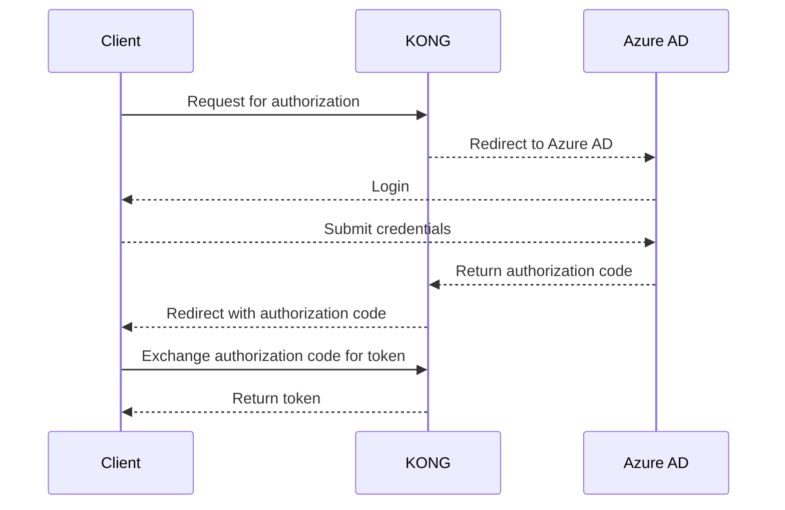
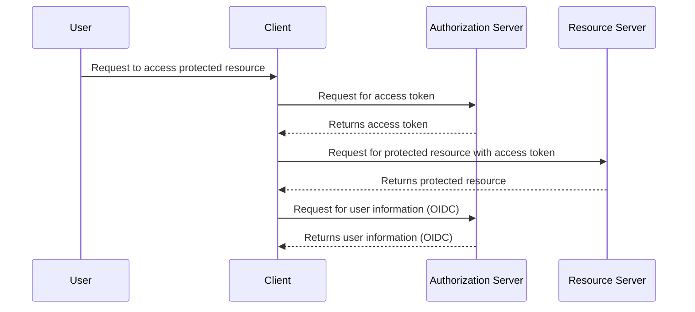

```mermaid
sequenceDiagram
    participant Client
    participant KONG
    participant Azure AD
    Client ->> KONG: Request for authorization
    KONG -->> Azure AD: Redirect to Azure AD
    Azure AD -->> Client: Login
    Client -->> Azure AD: Submit credentials
    Azure AD -->> KONG: Return authorization code
    KONG -->> Client: Redirect with authorization code
    Client ->> KONG: Exchange authorization code for token
    KONG -->> Client: Return token
```

```mermaid

sequenceDiagram
  participant User
  participant Client
  participant Authorization Server
  participant Resource Server

  User->>Client: Request to access protected resource
  Client->>Authorization Server: Request for access token
  Authorization Server-->>Client: Returns access token
  Client->>Resource Server: Request for protected resource with access token
  Resource Server-->>Client: Returns protected resource
  Client->>Authorization Server: Request for user information (OIDC)
  Authorization Server-->>Client: Returns user information (OIDC)

```
A-->B
